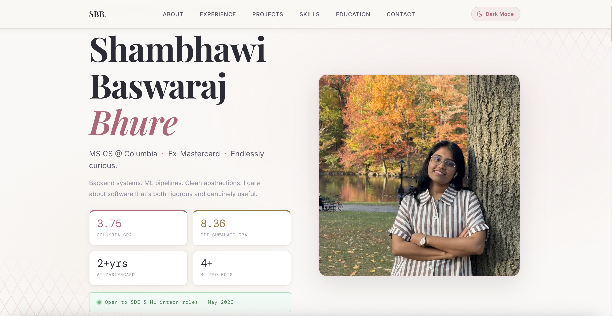
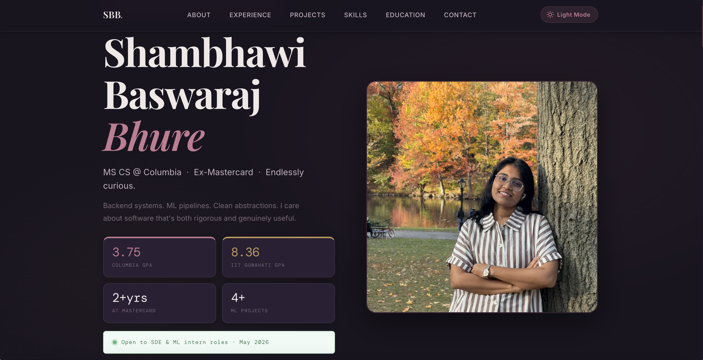

# 🌸 Shambhawi Bhure — Portfolio Website

> A personal portfolio website for **Shambhawi Baswaraj Bhure** — MS Computer Science student at Columbia University and former Software Engineer at Mastercard.

## 🔆 Light Mode

  

## 🔆 Dark Mode

  

---

## 🔗 Live Demo

**[→ View My Portfolio](https://shambhawibhure.github.io/)**  

---

## ✨ Features

### 🦸 Intro Section
- Full-screen intro with a headline, tagline, and a professional photo
- **Stat cards** highlighting key metrics (years of experience, projects, companies, etc.)
- **Availability badge** signaling open-to-work status at a glance
- Call-to-action buttons linking to projects and contact

### 🌓 Dark / Light Mode Toggle
- Pill-shaped theme toggle button in the navigation bar
- Switches between a warm light theme and a deep charcoal dark theme
- Smooth CSS transitions across all themed elements
- Persists to `localStorage` for returning visitors
- Collapses to an icon-only view on smaller screens

### 📱 Responsive Mobile Layout
- Fully responsive from small phones to wide desktops
- **Hamburger navigation menu** on mobile with smooth open/close toggle
- Fluid grid layouts that reflow gracefully at each breakpoint
- Touch-friendly tap targets throughout

### 💼 Experience Timeline
- Vertical timeline of professional roles with company, title, tenure, and key achievements
- Clean connector lines and dot markers
- Easily extendable via HTML

### 🗂 Projects Grid
- Card-based project grid with technology tags, and descriptions
- Hover effects with subtle lift and shadow transitions

### 🛠 Skills Section
- Organized skill groups (Languages, Frameworks, Cloud & DevOps, Tools, etc.)
- Tag-style chips with consistent styling

### 🎓 Education Cards
- Cards for each academic institution with degree, grade, and relevant coursework

### 📬 Contact Section
- Clean contact area with email link, LinkedIn, and GitHub handles

---

  Made with ☕ and a lot of CSS variables · <strong>Shambhawi Baswaraj Bhure</strong>

